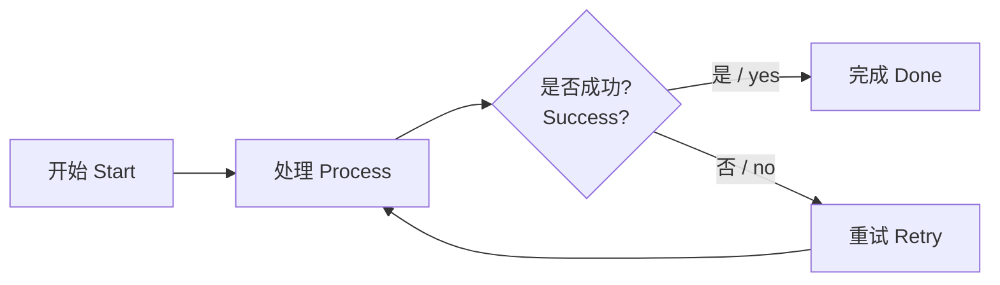

# 简介 / Introduction

这是一个示例 Markdown 文件，用于测试 **Pandoc** 容器镜像的转换能力（PDF / DOCX / PPTX），并包含 Mermaid 图、中文与英文混排。

## 代码块 / Code

下面是一个简单的 Python 代码示例：

```python
def greet(name):
    return f"Hello, {name}"
print(greet("世界 / World"))
````

## Mermaid 流程图（中英文） / Mermaid diagram (zh+en)



## 列表 / Lists

* 项目 A / Item A
* 项目 B / Item B

## 表格 / Table

| 中文 | English |
| -- | ------- |
| 一  | One     |
| 二  | Two     |

---
