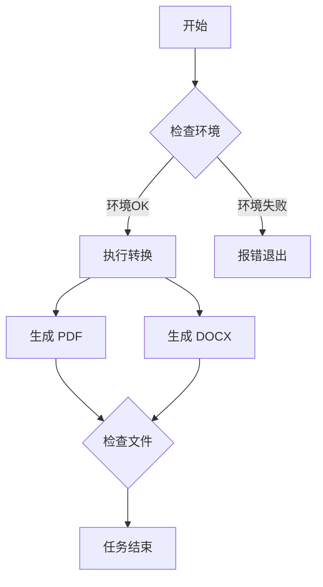

# 一级标题：中文与 Mermaid 支持

这是一个用于测试高度定制化 Pandoc 容器的示例文档。它包含了中英文混合内容、代码块以及 Mermaid 图表，以验证容器的各项功能是否正常工作。

## 英文和中文混合排版

This is a paragraph containing both English and Chinese. 这是一段包含英文和中文的段落。我们希望字体能够优雅地处理混合排版，例如 `inline code`（行内代码）和**粗体**、*斜体*等样式。

> 这是一个引用块。它应该有特殊的背景和边框样式，以区别于普通文本。
> Blockquotes should be beautifully rendered.

## 代码高亮测试

代码块应根据 `pygments.theme` 主题进行高亮。

### Python 示例

```python
# 这是一个 Python 注释
def greet(name: str) -> str:
    """一个简单的问候函数"""
    message = f"你好, {name}!"
    print(message)
    return message

greet("世界")
```

### Bash 脚本示例

```bash
#!/bin/bash
# 这是一个 Bash 注释
for i in {1..5}; do
  echo "Welcome $i times"
done
```

## Mermaid 图表渲染测试

下面的 Mermaid 代码块应该被自动渲染成一张流程图。



## 列表与表格

### 无序列表
- 第一项
  - 子项 A
    - 孙子项 1
- 第二项
- 第三项

### 有序列表
1. 准备工作
2. 执行命令
3. 完成部署

### 表格
| 姓名   | 部门     | 职位       |
|:-------|:--------:|:-----------|
| 张三   | 技术部   | 软件工程师 |
| 李四   | 产品部   | 产品经理   |
| 王五   | 设计部   | UI 设计师  |